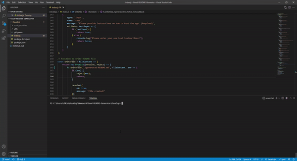

# Good-README-Generator
<h1>Good-ReadMe-Generator</h1>
  
<p>Good-ReadMe-Generator is a Content Management System that stores the user's information in MySQL. This application is used for managing a company's employee data using Node.js, inquirer, and CRUD operations.</p>
  
 ## User Story
 ```
AS A developer
I WANT a README generator
SO THAT I can quickly create a professional README for a new project
```

 <br>
  
</p>
  <h2>Table of Contents</h2>
  <ul> 
   <li><a href="#Installation">Installation</a></li> 
   <li><a href="#Usage">Usage</a></li>   
   <li><a href="#Contributing">Contributing</a></li>   
   <li><a href="#Questions">Questions</a></li>                         
  </ul>
  <h2 id="Installation">Installation</h2>                         
  <p>
  <ol>
<li>Clone this repository.<pre><code> git <span class="hljs-keyword">clone</span> <span class="hljs-title">https</span>://github.com/zhkim3/Good-README-Generator.git
</code></pre></li>
<li>Install Nodejs dependencies.<pre><code> npm <span class="hljs-keyword">install</span>
</code></pre></li>
<li>In the root directory of the project, start the app.<pre><code> <span class="hljs-keyword">node</span> <span class="hljs-title">index</span>.js
</code></pre></li>
</ol>
  <h2 id="Usage">Usage</h2>
  <p>After installation is complete, run the following code: ‘node index.js’ in the terminal. Answer the prompts and after completion, you should see a console log showing your answers to your prompts, a message that says ‘File created!’, and you should see your file under the ‘dist’ folder called ‘generatedREADME’. It’s generated in mark down syntax so you can copy and paste that code into your project! 
  <h2 id="Contributing">Contributing</h2>
  <p>Anyone is free to contribute to this application. Being an open source community makes the Dev community special. Any contributes are appreciated. </p>
  <h2 id="Questions">Questions</h2>
  <p style="strong">Any questions regarding this project, contact zhkim3@gmail.com directly.</p> 